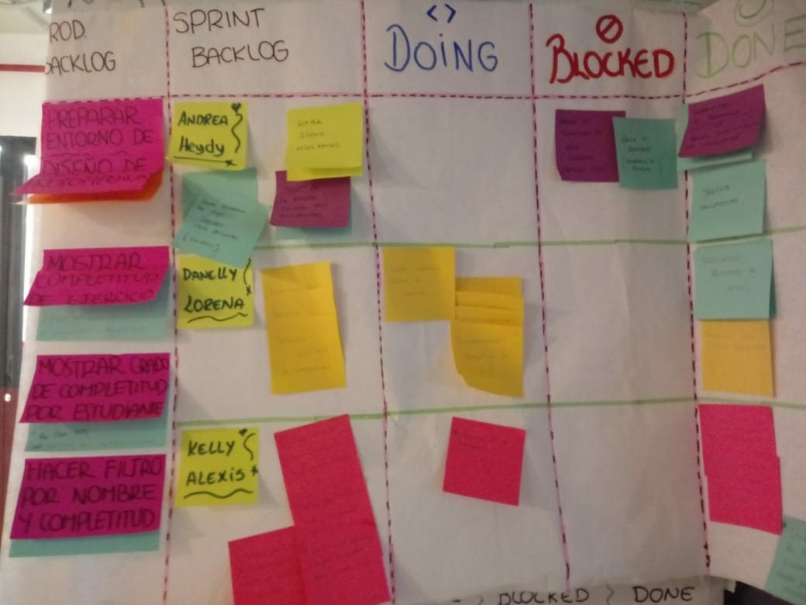
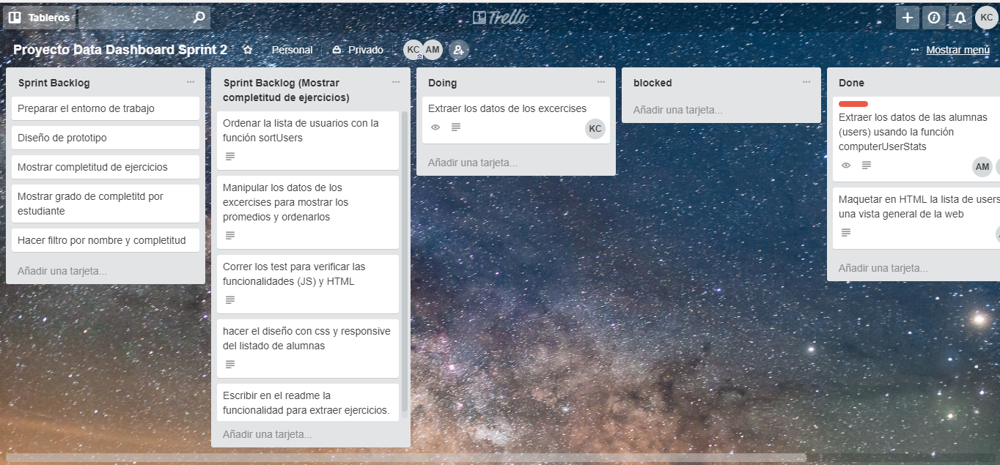
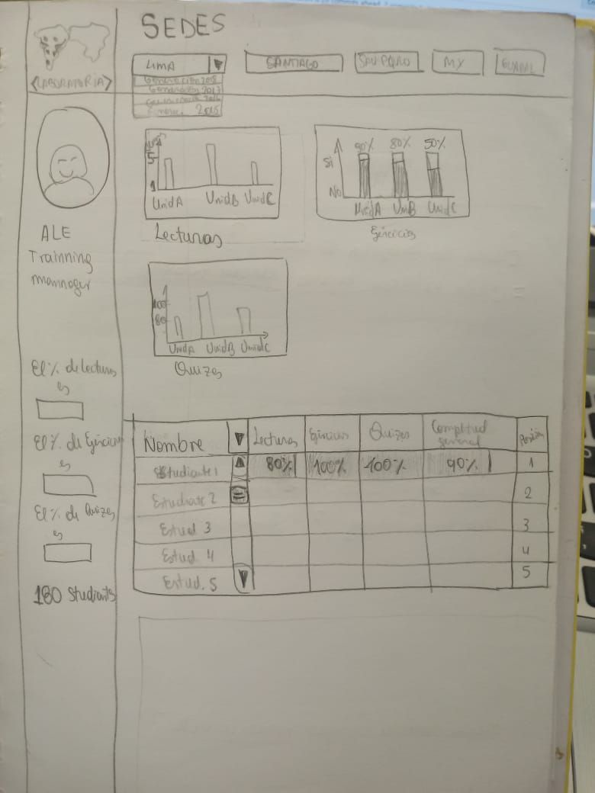
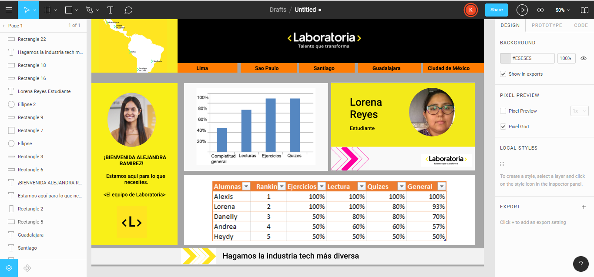

# Data Dashboard

# Preparación de entorno trabajo

## Sprint planning:

Periodo corto inicial del proyecto, desarrollado una vez por sprint, en el cual planificamos el desarrollo de las atividades que el equipo asume como meta.

## Organización con trello:

 Trello es una herramienta de planificación de trabajo colaborativo, útil para visualizar el avance de los proyectos.

# Definición del producto

Durante el proceso de definición del producto se entrevistó al principal usuario, la trainning manager de laboratoria, quien nos detalló que su principal objetivo era obtener una interfaz simple en la que pueda navegar intutitvamente y obtener los datos de los ejercicios completados de las alumnas, además remarcó la necesidad de proteger la marca de laboratoria.

Como uno de los datos más relevantes que requiere nuestra trainning manager, es ingresar al análisis de la data de las alumnas dividio por promoción para poder estudiar el momento actual. Como otro dato relevante, requiere que la web tenga una visualización que abarque de lo general a lo particular en cuestión de graficos. Además añadió que en cuestión de revisión  de datos, sería útil mostrar información para analizar diariamente, como los porcentajes de completitud, e información general que pueda analizar al final de cada proyecto, como los graficos en barra, pye o línea.

En base a la información recopilada, la web a diseñada resuelve el problema de usabilidad, ya que es intuitiva, con datos precisos y necesarios que además son agradables visualmente, con mensaje de motivación.

# Proceso de diseño

El proceso de diseño abarca 3 de las 4 fases del modelo de doble diamante:
## Descubrir:

Aquí se recogieron ideas que aportaron al producto, como el uso del actual identificador de alumnas para reconocer a cada una y el uso de mensajes de motivación en la bienvenida al usuario.

## Definir:

Aquí se priorizaron las solicitudes del readme ante las gráficas dinámicas, sin dejar de lado la usabilidad del producto.

## Desarrollar:

Aquí se crean prototipos de baja y alta fidelidad, además se realizan pruebas de la funcionalidad del producto durante cada sprint.

# Sketch de la solución

Prototipo de baja fidelidad

# Diseño de la interfaz de usuario

Prototipo de alta fidelidad (Diseño en figma)

# Implementación de la interfaz de usuario

